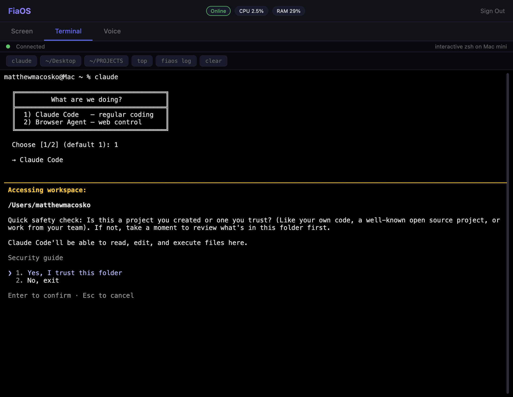
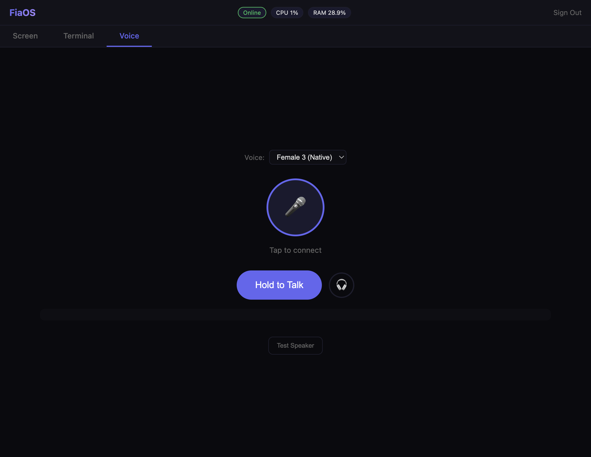
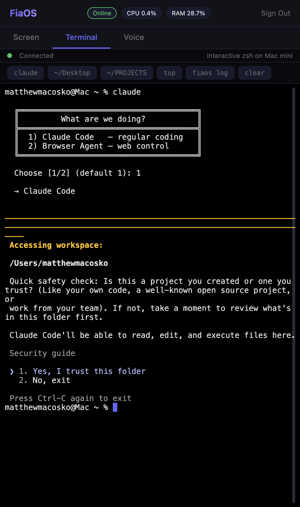

<div align="center">

# FiaOS

### Drive your Mac from anywhere.

**Live screen → real interactive shell → on-device voice agent — through one self-hosted page.**

[](LICENSE)
[](https://www.apple.com/mac/)
[](https://www.python.org/)
[](https://claude.com/claude-code)

[](https://github.com/nicedreamzapp/FiaOS/stargazers)
[](https://github.com/nicedreamzapp/FiaOS/network/members)

</div>

---

## ⚡ What it is

A single page that turns your Mac mini into a **fully remote-controlled headless dev box** — accessible from any device with a browser. Phone. Laptop. Friend's PC. Doesn't matter.

Three things, that's it:

| 🖥️ | **Screen** | Live screenshot of your Mac, refreshing every second. Click anywhere to drive the mouse. Type to send keys. |
|---|---|---|
| 💻 | **Terminal** | Real PTY-backed interactive zsh. `claude` works. `vim` works. `top` works. `cd` actually sticks. Rendered with [xterm.js](https://xtermjs.org/) so colors and ANSI escapes are pixel-perfect. |
| 🎙️ | **Voice** | Push-to-talk to a local on-device voice model ([PersonaPlex MLX](https://github.com/) on Apple Silicon). Loads on demand, idles out to free RAM. |

---

## 🎬 In action

### Run Claude Code on your Mac mini, from anywhere

<div align="center">



</div>

> *The Terminal tab is a **real PTY**. That means anything that needed a TTY — `claude`, `vim`, `htop`, `gh`, `python -i` — just works. No hacks, no faking it.*

### Voice agent, one tap away

<div align="center">



</div>

### Phone-friendly out of the box

<div align="center">



</div>

> *Open the URL on your phone, log in once, and you've got a real shell on your Mac mini in your pocket.*

---

## 🧠 Why

`tailscale` + an SSH client + a VNC viewer can each do a piece of this. FiaOS bundles them into **one auth-gated web page** so you can drive your Mac mini from any device — without installing anything client-side.

The Terminal tab specifically gets you a working **Claude Code session on your Mac mini, from your phone**. That's the killer feature this whole thing was built around.

---

## 🚀 Install

> **Requires:** Apple Silicon Mac · macOS 14+ · Python 3.12+

```bash
git clone https://github.com/nicedreamzapp/FiaOS.git
cd FiaOS
python3.12 -m venv .venv
.venv/bin/pip install -r requirements.txt
```

### 1. Set a password (required — server refuses to start without it)

```bash
python3 -c 'import secrets; print(secrets.token_urlsafe(24))'
```

### 2. Run it

```bash
FIAOS_PASSWORD='your-strong-password' .venv/bin/python3 server.py
# open http://localhost:9000
```

### 3. Make it permanent (LaunchAgent)

Copy [`examples/com.fiaos.server.plist`](examples/com.fiaos.server.plist) to `~/Library/LaunchAgents/`, edit the password and absolute paths, then:

```bash
launchctl load ~/Library/LaunchAgents/com.fiaos.server.plist
```

The bundled [`watchdog.sh`](watchdog.sh) script can be wired up the same way for self-healing.

### 4. Make it remote (optional)

| File | What it does |
|---|---|
| [`tunnel_to_vps.sh`](tunnel_to_vps.sh) | Opens an autossh reverse tunnel to a VPS so you can hit it at `https://fia.your-domain.com` |
| [`nginx-fia.conf`](nginx-fia.conf) | Matching nginx site config (HTTPS termination + WebSocket upgrade headers) |

Both are templates — replace the hostnames and key paths and you're live.

If you only want to use it on your home network, skip this step entirely.

### 5. Voice mode (optional)

Voice requires [PersonaPlex MLX](https://github.com/nicedreamzapp/) and Hugging Face access to the model weights. Once it's `pip install`-ed, FiaOS will spawn it on demand when you hit the Voice tab and shut it back down after 60 s of idle.

---

## 🔒 Security

| ✅ | Server **refuses to start** without `FIAOS_PASSWORD` set — no default fallback in the source |
| --- | --- |
| ✅ | Signed session cookies, persisted to disk so they survive restarts |
| ✅ | Login endpoint rate-limited (10 attempts / 5 min / IP) |
| ⚠️ | Terminal is a real PTY — anyone with the password has the same power as SSH. **Treat the password like an SSH key.** |
| ⚠️ | The `_PROTECTED_PATTERNS` regex blocks the obvious "kill FiaOS itself" footguns but is **not** a security boundary. A real shell can run arbitrary scripts. |
| 💡 | Want 2FA? Put FiaOS behind a reverse proxy that does it (Cloudflare Access, Authelia, etc.). |

---

## 📁 Layout

```
server.py           ─ aiohttp server, all routes, PTY terminal handler
executor.py         ─ natural-language → shell helper (legacy /api/command)
fia_ptt.py          ─ voice push-to-talk WebSocket bridge
fia_talk.py         ─ voice TTS layer
sample_voices.py    ─ voice sample preview helper
static/
  index.html        ─ single-page UI (Screen / Terminal / Voice)
  login.html        ─ password form
  *.js *.wasm       ─ Opus codec workers for voice streaming
launch_server.sh    ─ venv launcher used by the LaunchAgent
start.sh            ─ dev helper (starts server + tunnel + caffeinate)
watchdog.sh         ─ keep-alive checker
tunnel_to_vps.sh    ─ autossh reverse tunnel
nginx-fia.conf      ─ nginx HTTPS + WebSocket upgrade template
examples/           ─ LaunchAgent plist template
```

---

## 🛠️ Tech

- **Backend:** Python 3.12 · [`aiohttp`](https://docs.aiohttp.org/) · [`pty`](https://docs.python.org/3/library/pty.html) · [`Quartz`](https://pypi.org/project/pyobjc-framework-Quartz/) (screen capture) · [`psutil`](https://psutil.readthedocs.io/)
- **Frontend:** vanilla JS · [xterm.js 5.3](https://xtermjs.org/) · WebSocket · WebAudio
- **Voice:** [MLX](https://github.com/ml-explore/mlx) on Apple Silicon (via PersonaPlex)
- **Tunnel:** OpenSSH reverse forwarding · nginx HTTPS termination

---

## 📜 License

MIT — see [LICENSE](LICENSE).

---

<div align="center">

Built by [**Matt Macosko**](https://github.com/nicedreamzapp) · Fia is the assistant who lives on the Mac mini.

⭐ **If you find this useful, drop a star.**

</div>
