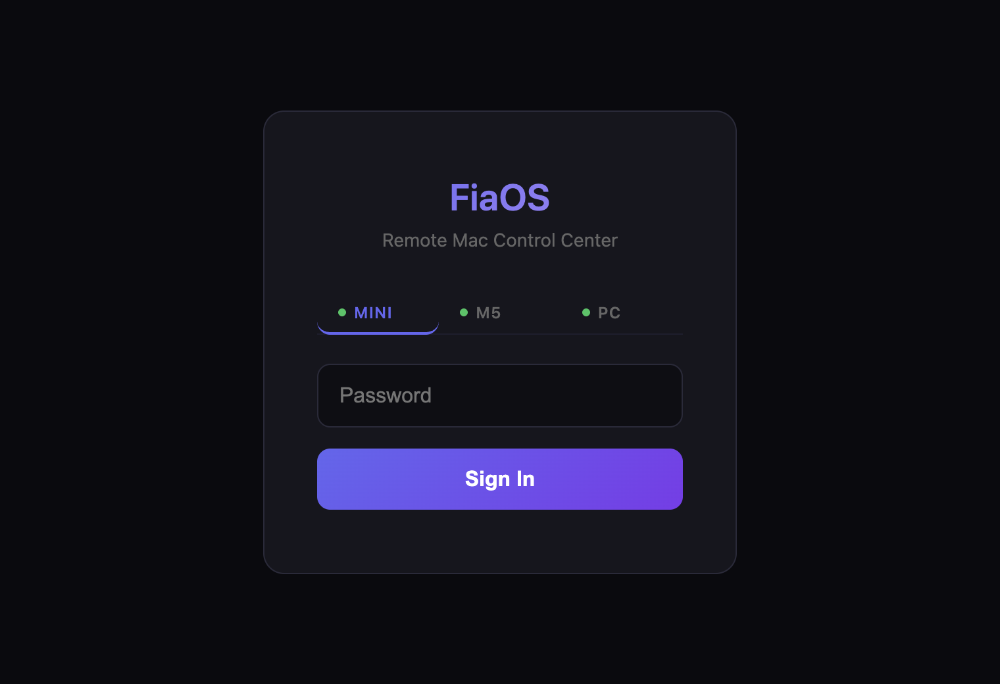
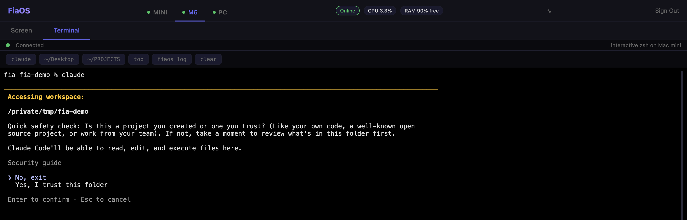
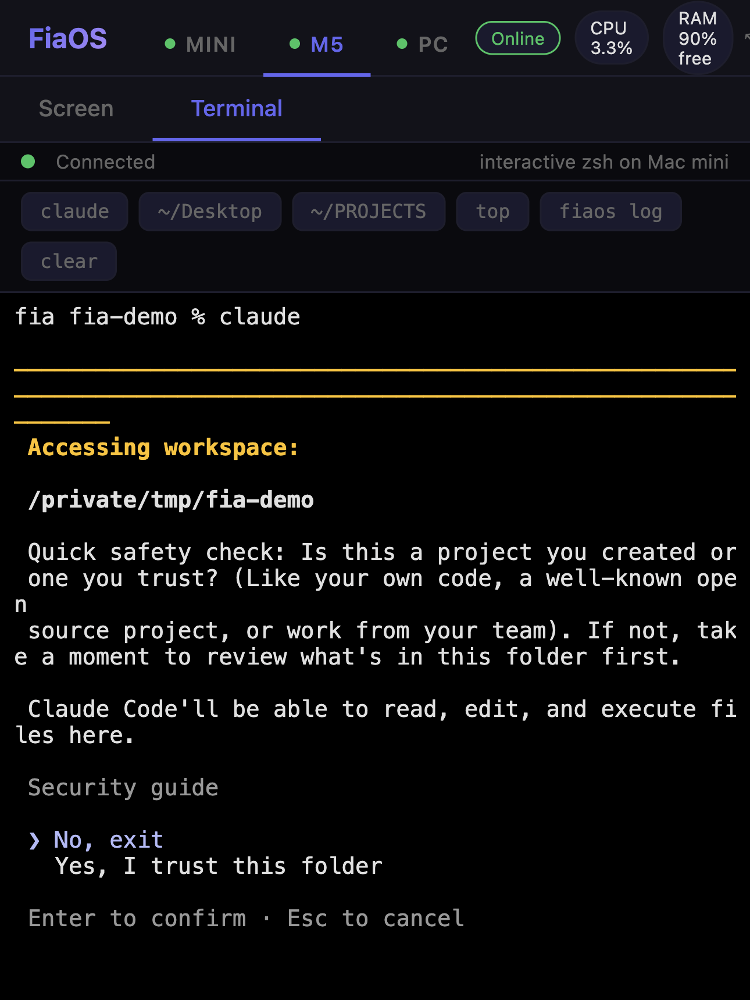

<div align="center">

# FiaOS

### Open a browser tab. You're now driving your computer.

**Live remote desktop · real PTY shell (Claude Code, vim, top — all real) · macOS *and* Windows · every machine you own behind one URL · self-hosted · zero cloud · zero API keys**

> 💡 **Looking for the iMessage version?** See [`claude-screen-to-phone`](https://github.com/nicedreamzapp/claude-screen-to-phone) — same idea, async text-driven workflow. **FiaOS is the live one** — open a web page, you *are* on the machine.

[](LICENSE)
[](https://www.apple.com/mac/)
[](windows/)
[](https://www.python.org/)
[](https://claude.com/claude-code)
[](https://github.com/awesome-selfhosted/awesome-selfhosted)

[](https://github.com/nicedreamzapp/FiaOS/stargazers)
[](https://github.com/nicedreamzapp/FiaOS/network/members)
[](https://github.com/sponsors/nicedreamzapp)

> **Tags:** `claude-code` · `mac-mini` · `apple-silicon` · `windows` · `remote-control` · `self-hosted` · `homelab` · `headless-mac` · `vnc-alternative` · `ssh-alternative` · `web-terminal` · `pty` · `conpty` · `xterm.js` · `ai-agent` · `remote-desktop`

</div>

---

## ⚡ What it is

A single page that turns your computer into a **fully remote-controlled headless dev box** — reachable from any device with a browser. Phone. Laptop. Friend's PC. Doesn't matter.

Three things, that's it:

| 🖥️ | **Screen** | Live view of the desktop, refreshing continuously. Click anywhere to drive the mouse. Type to send keys. |
|---|---|---|
| 💻 | **Terminal** | Real PTY-backed interactive shell — `zsh` on macOS, PowerShell in a ConPTY on Windows. `claude` works. `vim` works. `top` works. `cd` actually sticks. Rendered with [xterm.js](https://xtermjs.org/) so colors and ANSI escapes are pixel-perfect. |
| 🔀 | **Machines** | MINI · M5 · PC across the top. Tap one and the whole page is that computer — same login, same session, no reconnect. |

Two panels and a machine picker. That's the whole product.

---

## 🖥️ One URL. Every machine.

This is the part that makes FiaOS different from "a web SSH client."

You get **machine tabs** across the top — MINI · M5 · PC. Tap one, and the entire page — screen, terminal, files, everything — is now that machine. **No second login.** Session tokens are signed with the shared password, so a login on one machine is a login on all of them.

| | How it works |
|---|---|
| 🍪 | **The cookie is the router.** Picking a tab sets `fia_target`; nginx maps that to the tunnel for that machine. Nothing else about the request changes. |
| 🟢 | **Honest liveness dots.** Each tab probes its own machine's login page. Green means that box is genuinely answering — not that the tab exists. |
| 🔀 | **Dead-machine fallback.** If the machine you last picked is powered off, nginx serves an always-on one instead and rewrites the cookie, so a sticky tab from three days ago can't leave you staring at a 502. |
| ⚡ | **Direct LAN hops when they're available.** Machines on the same network proxy to each other directly, trying a fast link before wifi. Measured on the reference setup: **0.57 ms over a Thunderbolt bridge vs. 63 ms and unstable over wifi.** Set yours with `FIAOS_PEERS`. |

The reference deployment runs a Mac mini, a MacBook Pro, and a Windows PC on one hostname. Add or drop a machine by editing one `map` block in [`deploy/nginx-fia.conf`](deploy/nginx-fia.conf).

---

## 🪟 Windows

FiaOS started on Apple Silicon. It now runs on Windows 10/11 too — a real port living in [`windows/`](windows/), not a compatibility shim.

| macOS | Windows |
|---|---|
| `pty` + `zsh -l -i` | **ConPTY** via [`pywinpty`](https://github.com/andfoy/pywinpty) + PowerShell |
| Quartz `CGEvent` mouse/keyboard | **Win32 `SendInput`**, DPI-aware |
| `screencapture` | **native GDI/DXGI capture** |
| `caffeinate` keeps the display awake | **`SetThreadExecutionState`** |
| `pbcopy` / `pbpaste` | **`Get-Clipboard` / `Set-Clipboard`**, UTF-8 pinned on both ends |
| `osascript` app control | **Start Menu `.lnk` enumeration** |
| LaunchAgent | [`run_fiaos.ps1`](windows/run_fiaos.ps1) — restart loop with log rotation |
| — | **noVNC tab**, for when a polled screenshot isn't enough |

Same routes, same UI, same password, same session tokens. Switch to the PC tab and it looks and behaves exactly like the Macs.

> **Volume is the one honest gap.** Windows exposes no scriptable master volume without a COM dependency, so FiaOS drives the media keys instead — stepped up/down, and `GET /api/volume` returns `null` rather than inventing a number it can't read.

---

## 🎬 In action

### Every machine, one login

<div align="center">



</div>

> *The dots are real — each tab probes its own machine. Log in once and every green one is yours.*

### Run Claude Code on any of them, from anywhere

<div align="center">



</div>

> *The Terminal tab is a **real PTY**. That means anything that needed a TTY — `claude`, `vim`, `htop`, `gh`, `python -i` — just works. No hacks, no faking it.*

### Phone-friendly out of the box

<div align="center">



</div>

> *Open the URL on your phone, log in once, and you've got a real shell on every machine you own, in your pocket.*

---

## 🧠 Why

`tailscale` + an SSH client + a VNC viewer can each do a piece of this. FiaOS bundles them into **one auth-gated web page** so you can drive your whole fleet from any device — without installing anything client-side.

The Terminal tab specifically gets you a working **Claude Code session on your Mac, from your phone**. That's the killer feature this whole thing was built around. The machine tabs are what happened when one Mac turned into three computers.

---

## 💡 Use cases

> If any of these describe you, FiaOS exists for you.

- **🤖 Claude Code on iPhone / iPad** — Your desktop does the heavy lifting; your phone is just the front-end.
- **🏠 Headless homelab** — Plug the machines in, never connect a monitor again. Drive everything from a browser.
- **🔀 Mixed Mac + Windows shop** — One page, one password, both operating systems. Stop keeping two remote-access stacks alive.
- **🛡️ Self-hosted Cursor / Copilot Workspace alternative** — Same kind of agentic coding loop, on hardware you own, with no SaaS in the path.
- **📡 Replace SSH + VNC + RDP** — One web page does what used to take three apps and a subscription.
- **✈️ Travel light** — Borrow any laptop, hit your URL, you're back at your dev environment.

---

## ⚖️ Compared to

> **Already using [`claude-screen-to-phone`](https://github.com/nicedreamzapp/claude-screen-to-phone)?** That's the **async** sibling — text a command from anywhere, your Mac executes it, you get screenshots/videos back as iMessages. **FiaOS is the live mode** — open a web page, you're sitting at the machine in real time. Different superpowers, same family.

| Tool | Mode | Live screen | Real shell | Multi-machine | Mobile | Self-hosted | Native client? |
|---|---|:-:|:-:|:-:|:-:|:-:|:-:|
| **FiaOS** | **Live** | ✅ | ✅ PTY | ✅ **one URL** | ✅ | ✅ | ❌ none |
| `claude-screen-to-phone` | **Async (iMessage)** | ❌ | ⚠️ via cmd | ❌ | ✅ | ✅ | ✅ Messages |
| Tailscale + SSH | Live shell | ❌ | ✅ | ⚠️ per-host | ⚠️ | ✅ | ✅ required |
| VNC / RDP / ARD | Live screen | ✅ | ❌ | ⚠️ per-host | ⚠️ | ✅ | ✅ required |
| Cursor mobile | Async cloud | ❌ | ⚠️ | ❌ | ✅ | ❌ cloud | ✅ required |
| iSH / Termius | Live shell | ❌ | ✅ | ⚠️ per-host | ✅ | ⚠️ | ✅ required |
| ChatGPT app | Cloud chat | ❌ | ❌ | ❌ | ✅ | ❌ cloud | ✅ required |

---

## 🚀 Install

### macOS

> **Requires:** Apple Silicon Mac · macOS 14+ · Python 3.12+

```bash
git clone https://github.com/nicedreamzapp/FiaOS.git
cd FiaOS
python3.12 -m venv .venv
.venv/bin/pip install -r requirements.txt
```

### Windows

> **Requires:** Windows 10/11 · Python 3.12+ · must run in the **interactive desktop session** (screen capture and `SendInput` don't work from a service)

```powershell
git clone https://github.com/nicedreamzapp/FiaOS.git
cd FiaOS\windows
py -3.12 -m venv .venv
.venv\Scripts\pip install -r requirements-windows.txt
```

### 1. Set a password (required — the server refuses to start without it)

```bash
python3 -c 'import secrets; print(secrets.token_urlsafe(24))'
```

Use the **same password on every machine** — that's what makes one login cover the whole fleet.

### 2. Run it

```bash
# macOS
FIAOS_PASSWORD='your-strong-password' .venv/bin/python3 server.py
# open http://localhost:9000
```

```powershell
# Windows — reads the password from C:\ProgramData\fia\fiaos.env so it never
# appears on a command line or in shell history
.\run_fiaos.ps1
```

### 3. Make it permanent

| Platform | How |
|---|---|
| macOS | Copy [`examples/com.fiaos.server.plist`](examples/com.fiaos.server.plist) to `~/Library/LaunchAgents/`, set `FIAOS_PASSWORD` and `FIAOS_MACHINE`, then `launchctl load` it. |
| Windows | Register [`run_fiaos.ps1`](windows/run_fiaos.ps1) as a Task Scheduler **"at logon"** task for your user. It already restarts on exit and rotates its own log at 5 MB. |

### 4. Make it remote (optional)

| File | What it does |
|---|---|
| [`deploy/tunnel_to_vps.sh`](deploy/tunnel_to_vps.sh) | Reverse SSH tunnel from a machine to your VPS |
| [`deploy/nginx-fia.conf`](deploy/nginx-fia.conf) | The full multi-machine nginx site — cookie routing, per-machine liveness probes, WebSocket upgrade, static caching, dead-machine fallback |

Give each machine its own remote port (`9000`, `9010`, `9020`…) and list them in the `map` block. Home network only? Skip this entirely and hit `http://your-machine.local:9000`.

---

## 🔒 Security

| ✅ | Server **refuses to start** without `FIAOS_PASSWORD` set — no default fallback in the source |
| --- | --- |
| ✅ | Signed session cookies (HMAC over the shared password), persisted so they survive restarts |
| ✅ | Login endpoint rate-limited (10 attempts / 5 min / IP) |
| ✅ | On Windows the password is read from a file, never a command line — it stays out of shell history and `Get-CimInstance Win32_Process` |
| ✅ | Clipboard writes are piped through stdin, never interpolated into a PowerShell command line |
| ⚠️ | Terminal is a real PTY — anyone with the password has the same power as SSH. **Treat the password like an SSH key.** |
| ⚠️ | The blocked-command regexes stop the obvious footguns (`rm -rf /`, `rd /s C:\…`, "kill FiaOS itself"). They are a **guardrail on the natural-language command path, not a security boundary.** A real shell can run arbitrary scripts. |
| 💡 | Want 2FA? Put FiaOS behind a reverse proxy that does it (Cloudflare Access, Authelia, etc.). |

---

## 📁 Layout

```
server.py               ─ macOS aiohttp server: routes, PTY terminal, screen, files
executor.py             ─ natural-language → shell helper (/api/command)
screencast.py           ─ live screen encoder
screen_worker.py        ─ capture worker process
input_helper.py         ─ Quartz mouse/keyboard event injection

windows/                ─ the Windows port (same routes, native Win32 underneath)
  server.py             ─ ConPTY terminal, GDI capture, machine-to-machine proxy
  executor.py           ─ PowerShell command translator + blocked-command guards
  input_helper.py       ─ SendInput mouse/keyboard, DPI-aware
  screencast.py         ─ live screen encoder
  screen_worker.py      ─ capture worker process
  run_fiaos.ps1         ─ launcher: env from file, restart loop, log rotation
  requirements-windows.txt

static/
  index.html            ─ single-page UI (Screen / Terminal + machine tabs)
  login.html            ─ password form + machine picker with liveness dots
  vendor/               ─ xterm.js

deploy/
  nginx-fia.conf        ─ multi-machine nginx site (cookie routing + probes + fallback)
  tunnel_to_vps.sh      ─ reverse SSH tunnel

examples/               ─ LaunchAgent plist template
launch_server.sh        ─ venv launcher used by the LaunchAgent
start.sh                ─ dev helper (server + tunnel + caffeinate)
watchdog.sh             ─ keep-alive checker
```

---

## 🛠️ Tech

- **Backend:** Python 3.12 · [`aiohttp`](https://docs.aiohttp.org/) · [`psutil`](https://psutil.readthedocs.io/)
- **Terminal:** [`pty`](https://docs.python.org/3/library/pty.html) on macOS · [ConPTY via `pywinpty`](https://github.com/andfoy/pywinpty) on Windows
- **Screen + input:** [`Quartz`](https://pypi.org/project/pyobjc-framework-Quartz/) on macOS · Win32 `SendInput` + GDI on Windows
- **Frontend:** vanilla JS · [xterm.js 5.3](https://xtermjs.org/) · WebSocket · Canvas
- **Edge:** OpenSSH reverse forwarding · nginx HTTPS termination + cookie-based upstream routing

---

## ❓ FAQ

<details>
<summary><strong>Does this replace SSH?</strong></summary>

For interactive use, basically yes — the Terminal tab is a real PTY-backed shell, so anything that worked in SSH works here. For automation (`scp`, `rsync`, `git push` over SSH agent forwarding) you still want SSH.
</details>

<details>
<summary><strong>How do the machine tabs work — is that a separate login per machine?</strong></summary>

No. Session tokens are HMAC-signed with the shared password, and every machine runs the same verification, so one login is valid on all of them. Tapping a tab sets the `fia_target` cookie; nginx maps that cookie to that machine's tunnel. Nothing else about the request changes, which is why the switch is instant and the UI doesn't even flicker.
</details>

<details>
<summary><strong>What happens if a machine is turned off?</strong></summary>

Its tab shows a red dot, and nginx falls back to an always-on machine and rewrites your cookie — so a stale tab selection can't leave you looking at a 502. If you'd rather see the failure (you're mid-build on that box, say), one `map` entry turns the fallback off per machine.
</details>

<details>
<summary><strong>How is this different from VNC or Apple Remote Desktop?</strong></summary>

VNC streams the framebuffer continuously; FiaOS ships a JPEG only when the screen actually changed — frames are hashed, and an unchanged desktop returns `204 No Content`. On the reference setup that took a still desktop from ~1.4 Mbps down to nothing. It's much lighter on bandwidth, needs no native client, and works fine over a phone hotspot. (The Windows build also ships a real noVNC tab for when you *do* want the framebuffer.)
</details>

<details>
<summary><strong>Can I use this without exposing it to the internet?</strong></summary>

Yes — skip step 4. Run the server, hit `http://your-machine.local:9000` from any device on your home network. No tunnel, no nginx, no domain.
</details>

<details>
<summary><strong>What happened to the voice tab?</strong></summary>

It was in the April release and has since been pulled out of FiaOS — voice now lives in its own project instead of riding along in the server. This repo is screen, terminal and machines. The old `fia_ptt.py` / `fia_talk.py` helpers were dropped in v2 because nothing shipped was using them any more.
</details>

<details>
<summary><strong>Does it work without Claude Code?</strong></summary>

Of course. FiaOS is a remote-control web UI — Claude Code is just one of many programs you can run in the Terminal tab. `vim`, `nvim`, `tmux`, `htop`, `gh`, `node`, `python -i`, custom scripts — they all work because the shell is a real PTY.
</details>

<details>
<summary><strong>How is FiaOS different from a Tailscale + SSH setup?</strong></summary>

Tailscale + SSH gives you a terminal, per host. FiaOS gives you a terminal **plus** a live screen viewer **plus** a mobile-friendly UI **plus** every machine behind one tab bar — all behind one password on a single web page, with zero client-side install.
</details>

<details>
<summary><strong>Is this a Cursor mobile alternative?</strong></summary>

Sort of. Cursor mobile is a polished AI-coding UI tied to a SaaS. FiaOS is a self-hosted web shell that lets you run *whatever* AI coding agent you want (Claude Code, Aider, gh-copilot, your own scripts) on hardware you control.
</details>

---

## 💚 Sponsor

Solo dev. No VC. Built on a Mac in Humboldt County. If FiaOS saves you a Claude bill or just makes you smile, kick a few bucks at [github.com/sponsors/nicedreamzapp](https://github.com/sponsors/nicedreamzapp) — every dollar goes back into more local-first tools and keeping this 100% open source.

---

## 📜 License

MIT — see [LICENSE](LICENSE).

---

<div align="center">

Built by [**Matt Macosko**](https://github.com/nicedreamzapp) · Fia is the assistant who lives on the machines.

⭐ **If you find this useful, drop a star** — or [💚 sponsor](https://github.com/sponsors/nicedreamzapp) to keep it growing.

</div>
